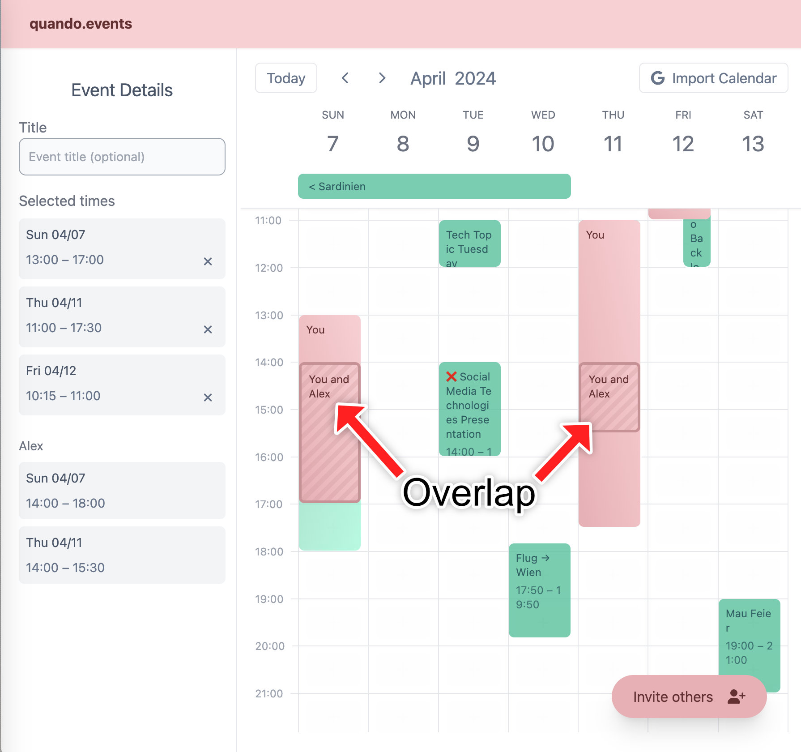

# quando.events

Busy Friends Make Scheduling Hard ... but quando.events makes it easy!
Ever tried planning an activity with three or more busy friends? You know how hard it can be. It inevitably takes a dozen messages going back and forth, trying to find out where your schedules align.

**That’s why I created [www.quando.events](https://www.quando.events/), a simple & free website that makes it easy to schedule meetings with friends.**

How it works:

1. Create a new meeting
2. Select your free time slots
3. Share the link with your friends
4. Meet in the overlap

Try it out now: [Create a new meeting](https://www.quando.events).

If you want to read about the concept and background, [read my blog post](https://filippo-orru.com/blog/busy-friends-make-scheduling-hard/).

# Tech

I went from the idea to release in just 10 days. Usually, I work with React, Flutter, or static websites, but for this project, I wanted to try out a new stack. I went with [Nuxt](https://nuxt.com), a meta-framework that bundles Vue with a backend and some other helpful bits into one compelling package. It offers great DX and enables extremely fast iteration.

Stack:
- Frontend
    - [Vue 3](https://vuejs.org/) for all UI. Includes server-side rendering with hydration.
    - [Typescript](https://typescriptlang.org), because if I have to use JS, I'd like to have types, please.
    - [Tailwind CSS](https://tailwindcss.com), for maintainable styling.
    - [Pinia](https://pinia.vuejs.org/), for managing state and persisting to local storage.
- Backend
    - API: [Nitro](https://nitro.unjs.io) with Websocket support, for sending real-time updates.
    - Database: [Redis](https://redis.io/) as a simple key-value store for the meeting data.
    - [Plausible Analytics](https://plausible.io/) because it's privacy-friendly and can be self-hosted
- DevOps
    - [Hetzner](https://www.hetzner.com/cloud/) for my cheap VPS. It powers all my services, including this website, *quando.events*, my [Four in a Row](https://filippo-orru.com/blog/four-in-a-row) game, and more.
    - [Traefik](https://traefik.io/traefik/) to proxy requests to the service.
    - [Docker Compose](https://docs.docker.com/compose/) to easily build and deploy the bundled Nuxt app, Redis, and Plausible.

## About Nuxt & Vue
Honestly, working with Nuxt was really pleasant. I've read that "opinionated products breed passionate customers" and this certainly rings true in the case of Nuxt. If you follow the conventions, *everything just works*.

Routing is based on directories by default. Server-side rendering works out of the box, which is important for good SEO and fast page loads. Of course, you still get all of Vue's reactivity after the page is *hydrated*, enabling highly interactive pages. 

Vue offers a lot of useful built-in components, like [transitions](vuejs.org/guide/built-ins/transition). Adding dialogs with [Headless UI](headlessui.com/vue/dialog) was a breeze.

# Challenges
Funny enough, the hardest part wasn't building the rather complicated calendar UI. Instead, it was getting Google's approval for the 'import events' functionality. There are lots of rules to follow. Some are obvious (add a privacy policy), and some aren't (make sure to show the 'AppId' in the browser's URL bar in your demo video).

> To try it out, head over to [www.quando.events](https://www.quando.events) now, and schedule a meeting with friends.

# More
- Read [how I redesigned this website](https://filippo-orru.com/blog/giving-my-blog-a-facelift).
- Learn more [about me](https://filippo-orru.com/about-me).
- Check out [my other posts](https://filippo-orru.com/blog/).
- Find me on [LinkedIn](https://linkedin.com/in/filippo-orru).